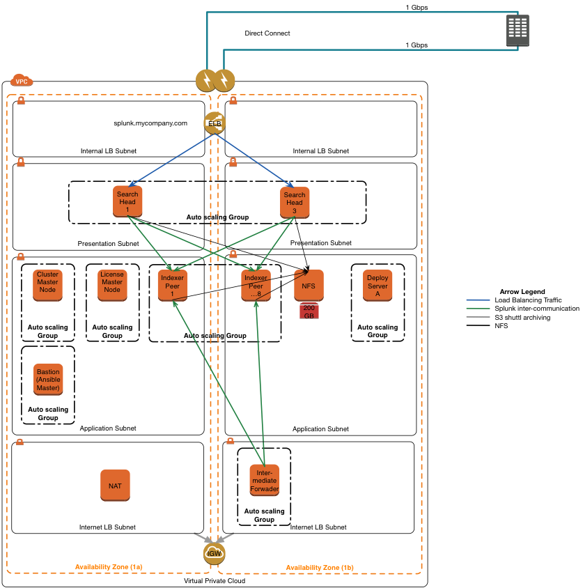

## Splunk on AWS (CloudFormation Template) 

The Cloudformation template, [splunk-app.json](splunk-app.json), builds the infrastructure needed to run a Splunk cluster on AWS. It provisions the following components spread over 2 Availability Zones:

* 1 SSL ELB
* 12 EC2 instances for the Search Heads (2), Peer Nodes (4), Cluster Master (1), License Master (1), Deployment Server (1), Intermediate Forwarder (1) and Bastion instance (1) plus their respective EBS volumes where necessary
* 10 Security Groups
* 3 IAM roles

### Assumptions
The template depends on and hence expects the following resources to exist:

* VPC with subnets for the Search Heads, Peer Nodes and Intermediate forwards (See architecture diagram below)
* EC2 keypair. The VPC and subnets can be built from the [core template](https://github.com/alanwill/cfn-core) which is the only on tested to work with splunk-app.json.
* An AMI to provision the NFS appliance. I recommend [SoftNAS](https://aws.amazon.com/marketplace/pp/B00EQE493U), however any NFS AMI should work.
* An X.509 SSL server certificate for ELB already uploaded to IAM via the [AWS CLI](http://docs.aws.amazon.com/cli/latest/reference/iam/upload-server-certificate.html)
* An S3 bucket containing configs to pull down to the servers, such as Splunk config files, certificates, Splunk apps and binaries etc.

### Architecture Diagram

## Future

Even though this template works, it's still a work in progress and I'd like to eventually make it more dynamic so that you can pass in via parameters the desired size of the cluster and CFN will provision it accordingly. Right now you'll need to edit the template in order to change it's size.

Add the ASGs as depicted in the diagram.

## Contributing

I can't say this enough, Pull Requests are very much welcomed. Hope this template helps others as much as it helps me. If you have any feedback on ways to improve it, I'm all ears. Submit an Issue if something doesn't work as advertised.

_alan_

  

